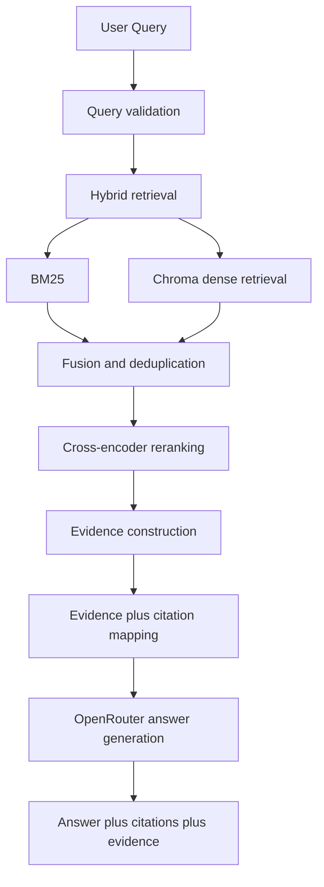
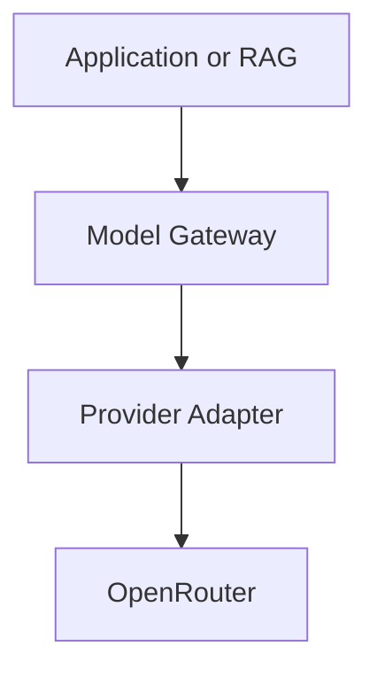
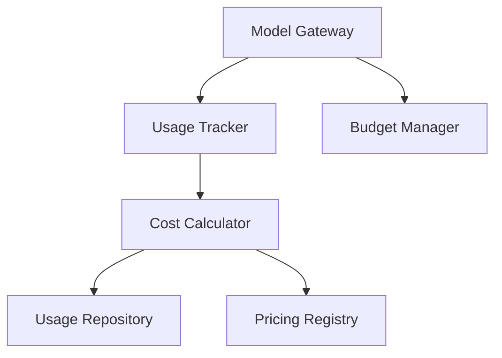
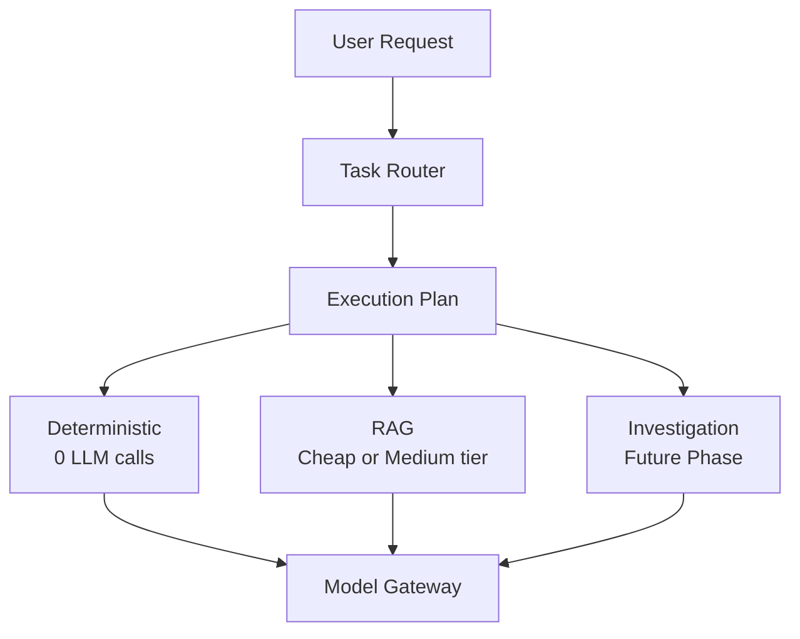
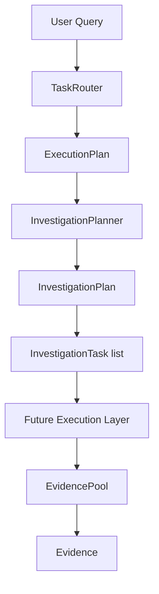
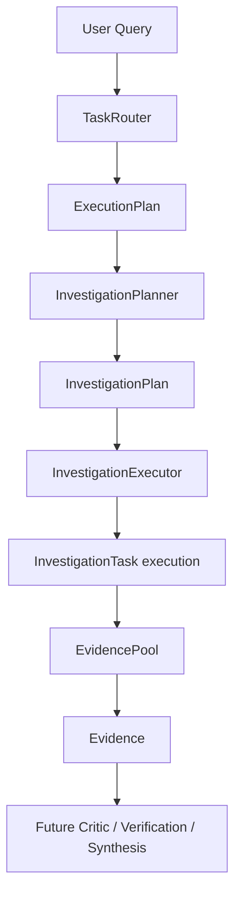
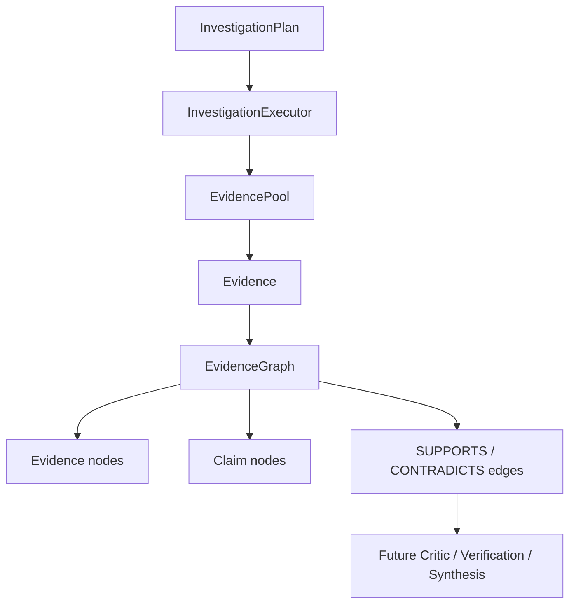
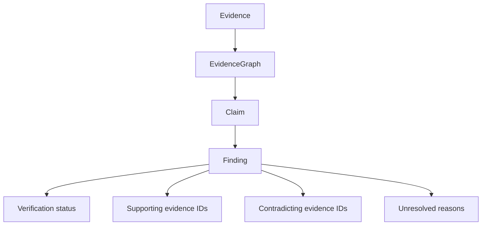

# Prometheus Architecture Baseline

**Baseline date:** 2026-09-19  
**Scope:** Phase 0 only. This document records the current repository state before implementing the next roadmap phase.

## 1. Executive Summary

Prometheus is intended to become an evidence-first AI investigation platform for organizations. The current runnable core is a document question-answering (RAG) system exposed through FastAPI. It supports local document ingestion, hybrid retrieval, cross-encoder reranking, grounded LLM generation, and optional OpenAlex academic context.

The planned multi-agent investigation system is not runnable yet. The LangGraph orchestrators, agent nodes, MCP server, and Streamlit investigation dashboard are mostly scaffolds with `NotImplementedError` or disabled controls. No architecture changes were made for this baseline.

## 2. Repository Structure

- `src/prometheus/api/`: FastAPI application and HTTP endpoints.
- `src/prometheus/rag/`: RAG pipeline, prompt construction, context formatting, and Pydantic contracts.
- `src/prometheus/retrieval/`: parsing, ingestion, embeddings, vector storage, BM25 search, hybrid fusion, reranking, and academic source clients.
- `src/prometheus/llm/`: LLM interface, mock client, OpenRouter client, and client factory.
- `src/prometheus/findings/`: SQLAlchemy Findings DB models and repository functions.
- `src/prometheus/agents/`: planned Planner, Researcher, Retriever, Critic, and Synthesizer nodes; currently stubs.
- `src/prometheus/graph/`: planned sub- and meta-orchestrator graphs; currently stubs.
- `src/prometheus/mcp/`: planned MCP interoperability; currently stubbed.
- `src/prometheus/evaluation/`: planned RAGAS and LLM-judge evaluation modules.
- `app/streamlit_app.py`: disabled Streamlit scaffold for the future investigation UI.
- `scripts/`: paper ingestion, demo RAG, diagnostics, database seeding, and minimal LLM checks.
- `tests/`: parser, retrieval, RAG, API, academic-source, scoping/deduplication, agent, graph, and live integration tests.

## 3. Entry Points

### FastAPI

The main backend application is `src/prometheus/api/app.py`, imported as `prometheus.api.app:app` for an ASGI server.

Current endpoints:

- `GET /api/rag/health`: returns service health.
- `POST /api/rag/ingest`: accepts a multipart file and optional `document_id`.
- `POST /api/rag/query`: accepts `RagQueryRequest` and returns `RagResult`.

CORS is currently configured with `allow_origins=["*"]`, all methods, and all headers.

### CLI and scripts

- `scripts/demo_rag.py`: offline mock or live OpenRouter document-Q&A demo.
- `scripts/ingest_papers.py`: searches arXiv, Semantic Scholar, and OpenAlex, downloads available PDFs, and ingests them.
- `scripts/seed_findings_db.py`, `scripts/diagnose_pdf.py`, and `scripts/test_llm_minimal.py`: supporting utilities.

### Streamlit

`app/streamlit_app.py` renders a title and disabled question control only. It does not call the FastAPI API or `run_investigation`.

## 4. Configuration and Persistence

Configuration is centralized in `src/prometheus/config.py`. It loads `.env` values through `python-dotenv` and exposes a cached `Settings` dataclass.

Important settings include:

- `OPENROUTER_API_KEY`, `OPENROUTER_BASE_URL`, `OPENROUTER_MODEL`
- `LANGSMITH_API_KEY`, `LANGSMITH_PROJECT`, `LANGSMITH_TRACING`
- `VECTOR_DB_BACKEND`, `CHROMA_PERSIST_DIR`, `QDRANT_URL`, `QDRANT_API_KEY`
- `DATABASE_URL`
- `SEMANTIC_SCHOLAR_API_KEY`, `OPENALEX_MAILTO`
- `MCP_SERVER_PORT`

The default vector backend is persistent Chroma at `./chroma_data`. Qdrant is recognized in configuration but raises `NotImplementedError` when selected. Findings persistence uses SQLAlchemy with SQLite by default (`sqlite:///./findings.db`) and asynchronous sessions.

## 5. Current Execution Paths

### 5.1 Document ingestion through the API

1. `POST /api/rag/ingest` receives an `UploadFile` and optional form `document_id`.
2. The API validates the extension against `retrieval.parsers.SUPPORTED_EXTENSIONS` (`.pdf`, `.docx`, `.pptx`, `.txt`).
3. The upload is copied to a temporary file.
4. `retrieval.ingestion.ingest_document` calls `retrieval.parsers.parse_document`.
5. The parser returns a `ParsedDocument` containing `DocumentSection` objects with page, slide, heading, and section-type metadata.
6. `chunk_sections` splits each section into approximately 800-character chunks with 100-character overlap.
7. `embed` creates embeddings using `sentence-transformers/all-MiniLM-L6-v2`.
8. Records receive UUIDs and metadata such as document ID, filename, file type, location, chunk index, ingestion time, and source path.
9. Records are written to the Chroma collection `prometheus_chunks` and appended to the BM25 JSONL index at `<CHROMA_PERSIST_DIR>/bm25_index.jsonl`.
10. The API returns the assigned document ID, original filename, and file type.
11. The temporary upload file is deleted in a `finally` block.

The CLI-specific `ingest_paper` and `ingest_domain_doc` functions use the older direct text/PDF parsing path and also write to Chroma plus BM25. They do not share all metadata behavior with `ingest_document`.

### 5.2 User query through the API

1. `POST /api/rag/query` validates the JSON payload as `RagQueryRequest`.
2. `api.app.rag_query_endpoint` forwards question, optional document scope, `top_k`, academic-evidence flag, and OpenAlex limit to `rag.pipeline.query_rag`.
3. The pipeline trims and validates the question.
4. If academic evidence is enabled, `retrieval.sources.openalex_client.search_openalex` is called first. OpenAlex records are converted into `PaperRecord` values and formatted by `rag.context.build_academic_context`. OpenAlex failure is logged and local RAG continues.
5. Local retrieval calls `retrieval.hybrid_search.hybrid_search` with an optional exact `document_id` filter and a candidate limit of `max(top_k * 3, 15)`.
6. BM25 loads and deduplicates the append-only JSONL corpus, then scores lexical matches.
7. Dense retrieval embeds the query and asks the configured vector store for Chroma similarity results.
8. Hybrid retrieval merges BM25 and dense hits with reciprocal rank fusion and removes duplicate IDs and duplicate text.
9. `retrieval.reranker.rerank` scores query/chunk pairs with `cross-encoder/ms-marco-MiniLM-L-6-v2`.
10. `apply_recency_and_credibility_filters` applies optional age filtering and source credibility/recency adjustments.
11. The top selected chunks are converted by `rag.context.build_context` into prompt context and typed `SourceRecord` citations.
12. `rag.prompts.build_rag_user_prompt` combines local context and optional OpenAlex context.
13. `llm.service.get_llm_client` returns the cached `OpenRouterClient`, unless mock mode is explicitly selected through the environment or a test injects `MockLLMClient`.
14. `OpenRouterClient.generate` calls the OpenAI-compatible OpenRouter chat completions API.
15. The pipeline returns `RagResult` containing answer text, local sources, academic sources, raw retrieved chunks, and `has_sufficient_context`.
16. FastAPI serializes the Pydantic result. `ValueError` becomes HTTP 400; other exceptions become HTTP 500.

If no local evidence and no academic context are available, the pipeline returns `INSUFFICIENT_CONTEXT_MESSAGE` without calling the LLM.

## 6. Implemented Functionality

- Multi-format parsing for PDF, DOCX, PPTX, and TXT.
- Page, slide, heading, and section metadata preservation.
- Persistent Chroma vector storage.
- BM25 lexical retrieval.
- Dense retrieval using sentence-transformer embeddings.
- Reciprocal rank fusion and duplicate-content suppression.
- Cross-encoder reranking.
- Optional recency and source-credibility scoring.
- Document-scoped retrieval through exact `document_id` filtering.
- OpenAlex academic search and graceful fallback when it fails.
- OpenRouter generation behind a basic abstract LLM client.
- Deterministic mock LLM for tests and offline demos.
- Structured local and academic citation response models.
- Initial Findings DB schema and repository functions for reports, claims, reasoning steps, and objections.

## 7. Current Limitations and Fragile Areas

### Not implemented

- `graph/meta_orchestrator.py` and `graph/sub_orchestrator.py` are not runnable.
- All five agent node modules are planned interfaces, not working agent implementations.
- Human approval, redirect, checkpointing, streaming graph events, and debate loops are absent.
- MCP server creation and tool registration are not implemented.
- Streamlit is a scaffold with a disabled button.
- Qdrant backend is not implemented.
- Evaluation modules are not an active quality gate.
- No production authentication, authorization, tenancy, connector framework, or document listing/deletion API exists.

### Fragile or duplicated areas

- There are two ingestion families: `ingest_document` uses unified parsers and location metadata, while `ingest_paper` and `ingest_domain_doc` use direct parsing and `_make_chunk_records`. Their metadata and chunk behavior can diverge.
- BM25 is append-only JSONL. Re-ingestion is deduplicated at read time, but stale records remain on disk and the index is rebuilt for each search.
- The vector store singleton and embedding/cross-encoder singletons are process-local. Multi-worker deployment and cache lifecycle are not addressed.
- `Settings` is cached at import time, so environment changes after module import are not reflected without process restart or explicit patching.
- `OpenAlex`, arXiv, and Semantic Scholar clients call external services synchronously with fixed timeouts and limited retry/rate-limit handling.
- The API exposes all origins through CORS and converts unexpected exceptions directly into response text, which is not suitable for a hardened production boundary.
- The API query path does not inject an LLM client, so production endpoint tests patch the pipeline factory rather than using a dependency-injection boundary.
- Retrieval and generation do not emit request IDs, stage timings, token counts, model usage, or cost data.
- OpenRouter generation returns only text; provider usage metadata is not retained.
- `findings.repository.get_report` is declared async but returns `session.get(...)` without awaiting it, so this path needs verification before use.
- Findings DB writes exist as repository functions but are not connected to the current RAG API or investigation graph.
- `hybrid_search.route` identifies Findings DB routing intent, but the current `hybrid_search` implementation only searches the BM25/vector document corpus; Findings DB routing is not wired through.
- Query-time citation trust depends on the LLM honoring prompt citation instructions; there is no post-generation citation validator.

## 8. Recommended Future Extension Points

These are placement recommendations only. They are not implemented in Phase 0.

### Model gateway

Place a provider-neutral gateway around the existing `BaseLLMClient` boundary, used by `rag.pipeline.query_rag` at the current `client.generate(...)` call. The gateway should select provider/model, normalize request and response metadata, handle retries/timeouts, and preserve the injectable mock path. `OpenRouterClient` should remain a provider adapter rather than the application-wide decision point.

### Cost tracker

Attach cost tracking to the model gateway response because that is the first stable point with model, usage, latency, and provider information. Persist or emit a per-request usage record from the API request boundary, carrying a request/investigation ID. Do not calculate cost inside prompts, retrieval, or source clients.

### Task router

Place routing between the API/application command boundary and the RAG pipeline. It should classify a request as document Q&A, academic search, or future investigation work, then dispatch to existing pipeline functions. The current `retrieval.hybrid_search.route` is store routing, not an application task router; it should remain a lower-level retrieval concern.

### Investigation manager

Use a new application-level service above `graph.meta_orchestrator` and below future API/UI commands. It should own investigation IDs, lifecycle state, cancellation/resume, human checkpoints, event streaming, and persistence coordination. It should call the graph once that graph is implemented, while leaving retrieval and model adapters behind their existing interfaces.

### Evidence engine

Build it around the normalized evidence boundary already represented by retrieved chunk dictionaries, `SourceRecord`, `AcademicSourceRecord`, and the Findings DB evidence IDs. It should normalize provenance, evidence identity, support/contradiction relationships, and citation validation after retrieval and before synthesis. The existing `rag.context` functions are formatting helpers, not yet an evidence graph.

## 9. Test Baseline

The repository has tests for:

- RAG context and prompt construction.
- Mock-LLM RAG execution.
- API health and query behavior.
- Document metadata and document isolation.
- PDF, DOCX, PPTX, and TXT parsing.
- BM25, dense, hybrid retrieval, and store-routing heuristics.
- BM25 re-ingestion and duplicate-content suppression.
- OpenAlex mapping, prompt integration, empty-result handling, and failure fallback.
- Agent and graph tests are present but intentionally skipped until those components are implemented.
- `test_integration_rag.py` is an optional live OpenRouter test and is skipped when `OPENROUTER_API_KEY` is absent.

The baseline commands are:

```powershell
uv run pytest -q
```

The plain `pytest -q` command is not available in the current global PowerShell environment. The declared uv environment uses Python 3.13 and is the correct project runner.

Observed Phase 0 results:

- `uv run pytest --collect-only -q`: 39 tests collected successfully.
- Focused dependency-light run: **13 passed, 4 skipped, 1 warning in 9.07s**.
- The full `uv run pytest -q` process provisioned all 166 packages but did not produce a test result during the baseline session; it remained silent during model-backed initialization and was stopped. This is an environment/runtime limitation, not recorded as a passing full-suite result.
- The warning is a Starlette `BlockingPortal` deprecation warning from the installed dependency.

## 10. Phase 1 - RAG Foundation

Phase 1 refactors the existing RAG path into an evidence-oriented flow without replacing its retrieval or generation implementations.



### Evidence abstraction

`prometheus.rag.models.Evidence` is the typed internal/public representation of one retrieved passage. It preserves available document ID, document name, chunk ID, text, page number, source type, retrieval method, retrieval score, reranker score, and raw provenance metadata. Missing values remain `null`.

`prometheus.rag.evidence.build_evidence` converts existing ranked retrieval dictionaries into `Evidence` objects. It uses the existing chunk ID as the evidence ID when present and does not invent missing document names, page numbers, or scores.

### Citation and response behavior

`prometheus.rag.context.build_context_from_evidence` generates prompt context and `SourceRecord` citations directly from normalized evidence. Legacy dictionary input remains supported through `build_context`, so existing callers retain their behavior.

`RagResult` keeps `answer`, `sources`, `academic_sources`, `retrieved_chunks`, and `has_sufficient_context`, and now adds `citations`, `evidence`, and `evidence_status`. The `citations` list mirrors the existing local source records for compatibility.

### Error handling and logging

- Empty and whitespace-only queries remain client validation errors.
- No local or academic evidence returns `evidence_status="no_evidence"` without calling the LLM.
- Retrieved candidates filtered away before generation return `evidence_status="insufficient_evidence"` without calling the LLM.
- Reranking failures raise `RagPipelineError`; the API maps them to HTTP 503.
- LLM provider failures are mapped to HTTP 502.
- Invalid document uploads and parser/value failures are mapped to HTTP 400; unexpected ingestion failures remain HTTP 500.
- Retrieval, evidence construction, reranking, generation, and ingestion emit stage/count logs without API keys or document contents.

### API compatibility

The existing endpoints and request fields are unchanged:

- `GET /api/rag/health`
- `POST /api/rag/ingest`
- `POST /api/rag/query`

Response fields were additive only. No model gateway, cost tracker, task router, investigation manager, evidence graph, agent, LangGraph, or frontend work was included in Phase 1.

### Phase 1 tests

Added `tests/test_evidence_foundation.py` with dependency-light coverage for Evidence validation, provenance preservation, evidence construction, citation mapping, hybrid fusion, reranker score propagation, empty queries, no evidence, insufficient evidence, reranker failures, LLM failures, and API error classification.

Observed Phase 1 validation results:

- `uv run pytest --collect-only -q`: **51 tests collected**.
- Phase 1 plus dependency-light compatibility suite: **25 passed, 4 skipped, 1 warning in 9.37s**.
- The relevant model-backed RAG/retrieval slice reached partial execution but remained silent during model initialization until the terminal's 60-second bound; it was stopped. No full model-backed pass is claimed.
- The warning remains the installed Starlette `BlockingPortal` deprecation warning.

Known limitations remain: evidence is currently a normalized retrieval representation rather than a graph; academic OpenAlex records remain represented separately as `AcademicSourceRecord`; there is no citation validator for generated text; and model-backed tests still depend on local sentence-transformer initialization.

## 11. Phase 2 - Model Gateway and Cost Infrastructure

Phase 2 establishes one provider-neutral boundary for model calls. The RAG pipeline still builds the same prompts and performs the same retrieval, but generation now passes through `prometheus.models.gateway.ModelGateway`.





### Provider abstraction

`prometheus.models.types` defines `ModelRequest`, `ProviderResponse`, `ModelResponse`, and normalized `ModelGatewayError`. Provider adapters implement a small `generate` contract and return provider-neutral values. Provider SDK response objects never leave the adapter.

`prometheus.models.providers.openrouter.OpenRouterProvider` owns OpenRouter authentication, OpenAI-compatible request construction, response parsing, token extraction, and provider error categorization. The legacy `prometheus.llm.openrouter.OpenRouterClient` remains as a text-only compatibility facade, but the SDK call is no longer located there.

### RAG integration

`rag.pipeline.query_rag` now calls `ModelGateway.generate`. Existing injected `BaseLLMClient` instances are adapted through `LegacyClientProvider` so current mock and compatibility callers continue to work. Default OpenRouter calls use the gateway's OpenRouter adapter and preserve provider-reported token usage when available. Retrieval, reranking, Evidence, citations, and prompts were not changed.

### Usage tracking

`prometheus.cost.models.LLMUsage` records provider, model, nullable token counts, nullable costs, latency, status, error category, investigation/task IDs, and timestamp. `UsageTracker` records successful and failed calls and aggregates totals, costs by model/provider, and average latency. The current repository is thread-safe in-memory and intentionally replaceable by a durable repository later. Prompts, responses, and API keys are not stored.

### Pricing and cost calculation

`PricingRegistry` is an explicit registry with no bundled production prices. Tests register clearly fake prices. `calculate_cost` returns unknown costs when pricing or either token count is missing; it never treats unknown usage as zero.

### Budget abstraction

`BudgetManager` supports configured budgets and `AVAILABLE`, `WARNING`, `EXCEEDED`, and `UNKNOWN` statuses. The gateway performs a pre-call exceeded-budget check and records the blocked call. It does not select or downgrade models; that remains a future routing concern.

The optional endpoints `GET /api/usage/summary` and `GET /api/usage/models` expose aggregate usage and configured pricing metadata without prompts or provider secrets.

### Future routing extension point

Phase 3 can choose a provider/model before calling `ModelGateway.generate`, using its model parameter and budget context. No intelligent routing, task classification, model tiers, or automatic downgrade behavior is implemented here.

### Phase 2 tests and limitations

`tests/test_model_gateway.py` covers request/response mapping, OpenRouter adapter parsing, normalized failures, missing usage, unknown pricing, usage aggregation, failed-call recording, budget statuses and blocking, multiple providers/models, RAG gateway integration, and the usage API.

Observed Phase 2 validation results:

- Gateway, cost, budget, provider, RAG integration, Phase 1 evidence, parser/source, scaffold, and API compatibility tests: **35 passed, 4 skipped, 1 warning in 16.86s**.
- `uv run pytest --collect-only -q`: **61 tests collected** after Phase 2 additions.
- The warning remains the installed Starlette `BlockingPortal` deprecation warning.
- Model-backed retrieval tests remain environment-limited by sentence-transformer initialization; no full model-backed pass is claimed.

Phase 2 does not add a database table for usage because the existing Findings DB is domain-specific and no durable usage schema was required yet. The in-memory repository is the deliberate persistence seam for a later infrastructure decision. Token usage remains unknown for compatibility clients that return text only, while the default OpenRouter adapter records provider usage when supplied.

## 12. Phase 3 - Cost-Aware Task Router

Phase 3 adds transparent, rule-based task planning. The router decides what kind of work a request needs; `ModelGateway` remains responsible for how an LLM invocation is performed.



### Routing levels and signals

`prometheus.routing.TaskRouter` uses a configurable `RoutingPolicy`, not an LLM classifier. It recognizes a small set of transparent signal groups:

- `DETERMINISTIC`: metadata, document listing, status, and health operations; zero LLM calls.
- `LOW`: factual lookups and summaries; existing RAG and the `CHEAP` logical tier.
- `MEDIUM`: comparisons, changes, synthesis, or multi-document requests; existing RAG and the `MEDIUM` tier.
- `HIGH`: causal questions, recommendations, investigations, competing explanations, or explicit research; the plan marks investigation as required and recommends `STRONG`.
- External/market/academic/web language sets `requires_external_research` without implementing external research execution.

Patterns can be replaced or extended through `RoutingPolicy.patterns`. No provider model names or prices are embedded in routing rules.

### Execution plan

`prometheus.routing.models.ExecutionPlan` contains route, complexity, logical model tier, LLM/RAG/investigation/external-research requirements, call cap, budget policy, concise rationale, qualitative confidence, and escalation capability. `RagResult.routing` exposes only concise `RoutingMetadata`; it does not expose internal reasoning or chain-of-thought.

### Model tiers and budget decisions

The logical tiers are `CHEAP`, `MEDIUM`, and `STRONG`. Phase 3 does not map them to provider-specific models; that remains a ModelGateway/provider configuration decision.

The router reads the existing `UsageTracker` summary through `BudgetManager`. A near-threshold budget changes a HIGH plan to reduced-depth `MEDIUM` execution and records that reason. An exceeded budget marks human confirmation as required. The router never silently selects a cheaper provider and does not implement adaptive investigation execution.

### Escalation interface

`EscalationManager` accepts an `EscalationRequest` for insufficient evidence, conflicting evidence, low retrieval quality, deeper research requests, ungrounded answers, or failed execution. It promotes the plan to the next level and records the trigger. Contradiction detection, evidence quality measurement, and investigation execution remain future phases.

### RAG integration

The existing `query_rag` flow now creates a plan before retrieval and adds routing metadata to all returned RAG results. It passes route, model tier, and investigation requirement as `budget_context` to the existing ModelGateway. Chroma, BM25, reranking, Evidence construction, citation behavior, and prompts are unchanged.

### Phase 3 tests and limitations

`tests/test_task_router.py` covers deterministic, LOW, MEDIUM, HIGH, external research, configurable policy, budget-aware decisions, escalation, empty requests, provider non-invocation, routing metadata, and RAG compatibility. Phase 3 does not implement a document metadata executor, investigation planner, external research executor, contradiction engine, model-tier mapping, or analytics dashboard.

Observed Phase 3 validation results:

- `uv run pytest --collect-only -q`: **72 tests collected**.
- Phase 3 plus Phase 1/Phase 2 dependency-light regression suite: **46 passed, 4 skipped, 1 warning in 9.39s**.
- Ruff and editor diagnostics passed for all Phase 3 touched files.
- The warning remains the installed Starlette `BlockingPortal` deprecation warning. Model-backed retrieval remains environment-limited by sentence-transformer initialization.

## 13. Phase 4 - Minimal Investigation Planner Contract

Phase 4 establishes implementation-ready contracts for describing bounded investigation work. It does not execute those tasks.



The boundaries are explicit:

- `TaskRouter` decides whether and how deeply to investigate.
- `InvestigationPlanner` defines bounded investigation tasks.
- A future executor will perform retrieval, external research, or other task work.
- `EvidencePool` stores evidence produced by that future execution layer.

### Contracts

`prometheus.investigation.models` defines `InvestigationTaskType`, `InvestigationTask`, `InvestigationPlanStatus`, `InvestigationPlan`, and `InvestigationPlannerInput`. The models reuse the existing Phase 3 `ExecutionPlan` and Phase 1 `Evidence` types; they do not redefine either abstraction.

Tasks validate non-empty identifiers and questions, positive priority/result limits, non-empty list entries, and unique dependencies. Plans validate task-count limits, unique task IDs, known and non-self dependencies, external-research consistency, and the requirement that READY plans contain tasks. Pydantic extra fields are forbidden.

`prometheus.investigation.planner.InvestigationPlanner` is a protocol with only `create_plan`. `RuleBasedInvestigationPlanner` creates a small deterministic plan for investigation routes and returns `NO_INVESTIGATION_REQUIRED` for ordinary RAG routes. It performs no LLM calls, retrieval, external research, recursion, or execution.

`prometheus.investigation.evidence_pool.EvidencePool` is a storage-only protocol using the existing `Evidence` model. `InMemoryEvidencePool` is provided for tests and future adapters; it has no persistence or dependency on Chroma, BM25, OpenAlex, providers, databases, or embeddings.

### Phase 4 tests and limitations

`tests/test_investigation_planner.py` covers task and plan validation, planner input behavior, bounded deterministic planning, non-investigation plans, provider non-invocation, external research flags, and in-memory evidence pooling.

Observed Phase 4 validation results:

- Phase 4 planner and evidence-pool tests: **29 passed**.
- No multi-agent orchestration, autonomous task execution, retrieval execution, external research execution, contradiction detection, evidence graph, persistence, or frontend functionality was added.

## 14. Phase 5 - Investigation Execution

Phase 5 adds a deterministic sequential execution layer for already validated investigation plans.



The responsibilities remain separate:

- `TaskRouter` decides routing.
- `InvestigationPlanner` defines tasks.
- `SequentialInvestigationExecutor` executes tasks sequentially.
- `EvidencePool` stores evidence for one investigation.
- A future synthesis layer will produce the final answer.

### Phase 4 invariant changes

`InvestigationPlan` now rejects cyclic dependency graphs with a local DFS validation. `priority=1` means highest priority; lower numeric priorities execute first when dependencies permit. `depends_on` identifies prerequisites, and a task executes only after its dependencies complete successfully or are explicitly skipped by the executor.

`source_scope` is a logical source category such as `internal_documents`, `uploaded_files`, `financial_documents`, or `external_research`; it is not a Chroma collection, BM25 index, table, or model name. `required_evidence_types` describes semantic requirements such as `financial_metric` or `document_claim`. `max_results` bounds requested evidence candidates and is not a guarantee. `max_tasks` bounds the number of plan tasks and is not a token or LLM-call budget.

`InMemoryEvidencePool` represents one investigation. It associates evidence with producing task IDs, deduplicates repeated non-null `evidence_id` values, returns task-scoped or all-investigation evidence, and clears only its own state. It remains non-persistent.

### Executor contract and dispatch

`prometheus.investigation.executor.InvestigationExecutor` accepts an `InvestigationPlan` and an `EvidencePool`, returning `InvestigationExecutionResult`. `SequentialInvestigationExecutor` uses a deterministic dependency-safe order: dependencies first, then lower numeric priority, then task ID. It never executes a task twice.

Document retrieval reuses `retrieval.hybrid_search.hybrid_search` and Phase 1 `build_evidence`. External research reuses the existing OpenAlex client and converts available paper abstracts into Evidence. Evidence analysis and comparison only inspect evidence already in the pool; they do not call an LLM or create conclusions. Retrieval and external interfaces are injectable for tests and future adapters.

Failures are isolated: failed tasks receive `FAILED`, dependents receive `SKIPPED`, independent tasks continue, and the overall result is `COMPLETED`, `PARTIAL`, or `FAILED`. No final answer is generated.

### Phase 5 tests and boundaries

`tests/test_investigation_executor.py` covers result contracts, ordering, priority, deterministic tie-breaking, retrieval dispatch and limits, external research reuse, evidence-only analysis/comparison, failure isolation, skipped dependencies, cyclic plans, EvidencePool deduplication/isolation, and the absence of provider or agent-framework imports.

Phase 5 does not implement multi-agent orchestration, autonomous execution beyond this explicit sequential component, model calls, synthesis, verification, contradiction detection, evidence graphs, persistent investigation storage, or frontend behavior.

## 15. Phase 6 - Evidence Graph

Phase 6 structures collected evidence and explicitly supplied claims without deciding which claim is true.



### Graph model and construction

`prometheus.investigation.models` now defines `EvidenceGraphNodeType`, `Claim`, `ClaimOrigin`, `EvidenceRelationType`, and `EvidenceGraphEdge`. Claims are structured assertions supplied by callers; Phase 6 does not extract claims from evidence. Claim provenance is explicit through `origin` and optional `origin_detail`, with `CALLER_SUPPLIED` as the compatibility default. Claims must reference existing Evidence IDs, and the graph creates explicit `Evidence -> Claim` `SUPPORTS` edges from those references.

`EvidenceGraphEdge` has a stable `edge_id`. Callers may provide one, or the model derives a deterministic ID from source, relation, and target. `EvidenceGraph` and `InMemoryEvidenceGraph` provide deterministic in-memory storage for one investigation. Evidence IDs, claim IDs, edge IDs, and relations are unique. `SUPPORTS` is restricted to Evidence-to-Claim, while `CONTRADICTS` supports Claim-to-Claim and Evidence-to-Claim relationships. Queries are sorted deterministically by edge ID.

`build_evidence_graph` reads one investigation's EvidencePool, adds supplied claims, validates provenance references, and creates support edges. It does not run contradiction detection.

### Contradiction detection

`ContradictionDetectorProtocol` exposes `detect(graph) -> list[EvidenceGraphEdge]`. `ContradictionDetector` is deliberately narrow and deterministic: it detects only claims with the same normalized subject and equal numeric magnitude where one explicitly says `increased by` and the other says `decreased by`. It performs no LLM calls, embeddings, semantic similarity, truth ranking, confidence scoring, or graph mutation. A contradiction only records that structured claims conflict; it does not determine which claim is correct.

### Phase 6 tests and boundaries

`tests/test_evidence_graph.py` covers graph models, node/edge validation, duplicate prevention, support relations, provenance integrity, deterministic queries, and construction from EvidencePool. `tests/test_contradiction_detector.py` covers explicit contradiction detection, non-contradictions, non-mutation, and provider isolation.

Phase 6 does not implement claim extraction, semantic contradiction detection, critic/verifier behavior, synthesis, final answer generation, graph persistence, graph databases, agents, or frontend visualization.

## 16. Phase 7 - Finding Model and Verification Status

Phase 7 adds a validated representation of the current evidentiary state of an explicit claim.



`prometheus.investigation.findings.Finding` records `UNVERIFIED`, `SUPPORTED`, `CONFLICTING`, or `INSUFFICIENT_EVIDENCE`. These statuses describe the current evidentiary state only; none means that a claim is objectively true or false.

The model validates non-empty finding/claim IDs, non-empty and unique evidence IDs, disjoint supporting and contradicting evidence lists, and non-empty unresolved reasons. `SUPPORTED` requires support evidence, `CONFLICTING` requires evidence plus an unresolved reason, and `INSUFFICIENT_EVIDENCE` requires an unresolved reason. `UNVERIFIED` may remain empty. Strict Pydantic extra-field rejection prevents truth, confidence, probability, and arbitrary fields from entering the model.

Phase 7 does not perform evidence resolution, source ranking, contradiction resolution, LLM calls, provider calls, confidence scoring, truth determination, graph mutation, critic/verifier work, synthesis, or answer generation. The Finding layer remains independently testable and preserves the earlier graph, executor, RAG, routing, and gateway behavior.

## 17. Phase 8 - Deterministic Verification Assessment

Phase 8 adds a deterministic traceability layer over the Phase 7 Finding model.

Input:

- `Finding`
- `EvidenceGraph`

Output:

- `VerificationAssessment`

Purpose:

- Validate and expose traceability of a Finding's evidentiary status.
- Preserve the Finding's ID, claim ID, verification status, evidence IDs, and unresolved reasons.
- Resolve supporting and contradicting graph edge IDs from evidence-to-claim relationships.
- Produce a deterministic rationale and assessment ID.

Boundary:

- No truth determination.
- No confidence or probability scoring.
- No LLM verification.
- No provider calls.
- No retrieval or external research.
- No contradiction resolution.
- No Finding status rewriting.
- No final-answer synthesis.

## 18. Phase 8.5 - Architecture Hardening

Phase 8.5 tightens contracts before any model-assisted critic or verifier is introduced.

### Edge identity

`EvidenceGraphEdge.edge_id` is now first-class. Phase 8 assessments reference graph edge IDs directly instead of reconstructing pseudo-identities from source, relation, and target. This supports future audit logs, UI review, persistence, and reproducibility.

### Claim provenance

`Claim.origin` and `Claim.origin_detail` make claim provenance explicit. The default remains `CALLER_SUPPLIED` for compatibility, while the enum leaves room for user input, document extraction, manual review, model generation, and future verification-layer claims. This records where a claim came from without adding claim extraction or model-based verification.

### Test categories

Pytest markers now separate deterministic unit validation from environment-dependent tests:

- `integration`
- `model_backed`
- `live_provider`

The default test run skips integration/model-backed tests. Use `--run-integration` to include them deliberately. This keeps CI-style validation fast and deterministic while preserving explicit coverage for live/model-backed paths.

### Invariants before Phase 9

- Findings remain the source of truth for evidentiary status validity.
- Verification assessment validates graph traceability and does not rewrite Finding status.
- Evidence, claim, finding, and assessment identities are preserved across traceability checks.
- Phase 9 must build on these deterministic contracts rather than bypassing them with model output.
