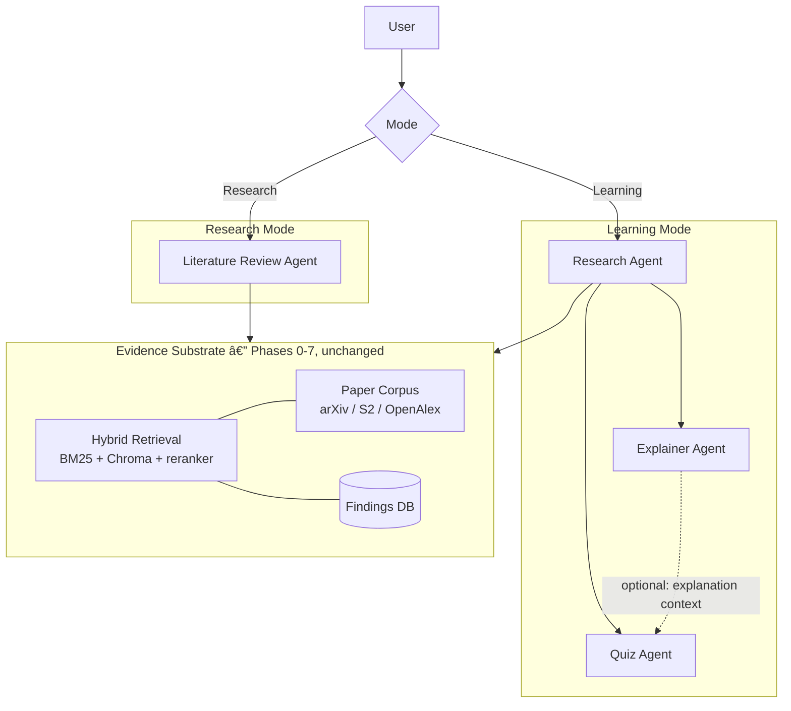
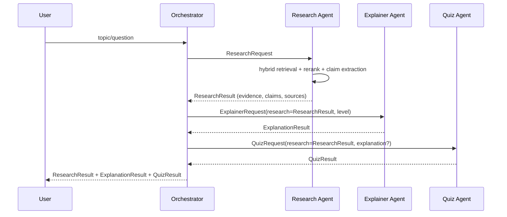
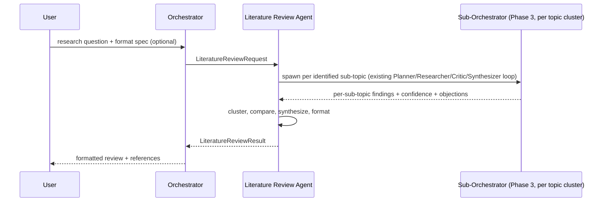

# Phase 9 — Multi-Agent Redesign: Agent Contracts & Orchestration Boundary

Status: design, not implemented. This document is the spec Phase 9 delivers;
Phases 10-13 implement one agent each against it, Phase 14 wires
orchestration, Phase 15 evaluates the result. Nothing in Phases 0-7 is
deleted — this document repositions that work as the evidence/retrieval
substrate all four agents sit on top of, per `docs/architecture.md`.

## 1. Motivation

Instructor feedback: differentiate agents by **responsibility**, not by
system prompt. "Research this" / "Explain this" / "Quiz on this" as three
prompt variants over one generic call is indistinguishable from a single
chatbot wearing three hats. The fix is to give each agent a distinct
**input/output contract** — so each can be built, tested, and evaluated in
isolation, and so the boundary between agents is a data contract instead of
a prompt convention.

## 2. Revised architecture

Two workflows share one evidence substrate:



Only the **Research Agent** and the **Literature Review Agent** are allowed
to touch the evidence substrate. The Explainer and Quiz agents never
retrieve independently — they consume what the Research Agent already
found. This is the single most important rule in this document: it is what
keeps the Explainer's simplification and the Quiz's questions grounded in
the same evidence, instead of each agent hallucinating its own version of
the topic.

```text
Research Agent  ──evidence──▶  Explainer Agent
Research Agent  ──evidence──▶  Quiz Agent
```

not:

```text
User ──▶ Research Agent  ──▶ answer 1
User ──▶ Explainer Agent ──▶ answer 2   (ungrounded, independent)
```

## 3. End-to-end workflows

### 3.1 Learning Mode



Explainer and Quiz run **after** Research completes and both take
`ResearchResult` as an input field — never a free-text topic string. A
request that has no `ResearchResult` yet is invalid for either agent (see
contracts below); the orchestrator enforces the ordering, the agents don't
have to re-check it, but they do validate the field is non-empty.

### 3.2 Research Mode



The Literature Review Agent is the one place the existing Phase 2/3
Planner → Researcher/Retriever → Critic ↔ Synthesizer debate loop is
reused wholesale, per sub-topic — it is not reimplemented. Learning Mode's
Research Agent is deliberately *not* this: it is a single retrieve-assess
pass (Phase 1 hybrid search + rerank), not a debate loop. Learning Mode
favors speed (a student asking "explain X" should not wait on a multi-round
critic debate); Research Mode favors rigor.

## 4. Agent contracts

Style follows `prometheus.rag.models` (Pydantic, `Field(description=...)`
on every field so the schema is self-documenting).

### 4.1 Research Agent

**Question it answers:** "What information/evidence do we need?"

**Allowed to call:** `prometheus.retrieval.hybrid_search`,
`prometheus.retrieval.reranker`, `prometheus.retrieval.sources.*`
(arXiv/S2/OpenAlex clients), `prometheus.findings.repository.search_findings`
(recall past reports).

**Must not:** simplify, rephrase for a target audience, or generate quiz
content. Must not fabricate a claim with no `supporting_evidence_ids`.

```python
class ResearchRequest(BaseModel):
    topic: str = Field(description="User's topic or question.")
    document_id: str | None = Field(default=None, description="Optional scope to a single ingested document.")
    include_academic: bool = Field(default=False, description="Whether to query external paper sources (OpenAlex etc.).")
    max_sources: int = Field(default=10, description="Cap on returned evidence items.")

class Claim(BaseModel):
    statement: str = Field(description="A single factual claim extracted from evidence.")
    supporting_evidence_ids: list[str] = Field(description="chunk_id/source_id values from `evidence`/`sources` backing this claim. Never empty.")
    confidence: float = Field(ge=0.0, le=1.0, description="Retrieval/rerank-derived confidence, not an LLM self-rating.")

class ResearchResult(BaseModel):
    topic: str
    evidence: list[SourceRecord] = Field(description="Local retrieved+reranked chunks, per prometheus.rag.models.SourceRecord.")
    academic_sources: list[AcademicSourceRecord] = Field(default_factory=list)
    claims: list[Claim] = Field(description="Every claim must cite at least one evidence/academic_source id.")
    has_sufficient_evidence: bool = Field(description="False if retrieval returned nothing usable; downstream agents must handle this explicitly, not silently proceed.")
```

**Failure handling:** if `has_sufficient_evidence` is `False`, the
orchestrator does not call Explainer/Quiz — it surfaces
`INSUFFICIENT_EVIDENCE` to the user directly (reuses the existing
`INSUFFICIENT_CONTEXT_MESSAGE` pattern from `prometheus.rag.pipeline`).

**Test criteria:** given a fixed corpus, `claims` are all traceable to
`evidence`/`academic_sources` ids that actually exist in the same result
(referential integrity is a unit test, not a judgment call).

### 4.2 Explainer Agent

**Question it answers:** "How can I understand this easily?"

**Allowed to call:** the model gateway/LLM client only. **Not** allowed to
call retrieval, OpenAlex, or the Findings DB — its only source of truth is
the `ResearchResult` it's handed.

```python
class ExplainerRequest(BaseModel):
    research: ResearchResult = Field(description="Must come from a prior Research Agent call in the same session; never constructed from a bare topic string.")
    levels: list[Literal["eli5", "beginner", "technical"]] = Field(default=["eli5", "beginner", "technical"])

class LevelExplanation(BaseModel):
    level: str
    intuition: str = Field(description="Plain-language framing, no jargon.")
    example: str
    explanation: str
    key_takeaway: str

class ExplanationResult(BaseModel):
    topic: str
    levels: list[LevelExplanation]
    source_evidence_ids: list[str] = Field(description="Union of evidence ids actually referenced across all levels — lets the UI show 'grounded in N sources'.")
```

**Failure handling:** if `research.claims` is empty, return a result whose
`levels` explicitly say evidence was insufficient rather than explaining
from the model's parametric knowledge — this agent's whole value
proposition is that it explains *this* evidence, not the topic in general.

**Test criteria:** every `LevelExplanation` traces back to at least one id
in `source_evidence_ids`, and `source_evidence_ids ⊆ research`'s own
evidence/claim ids (no new sources introduced).
### 4.3 Quiz Agent

**Question it answers:** "Do I actually understand it?"

**Allowed to call:** the model gateway/LLM client only. Same restriction as
Explainer — no independent retrieval.

```python
class QuizRequest(BaseModel):
    research: ResearchResult
    explanation: ExplanationResult | None = Field(default=None, description="Optional; if provided, questions may target specific levels.")
    difficulty: Literal["easy", "medium", "hard"] = "medium"
    question_count: int = Field(default=5, ge=1, le=20)
    question_type: Literal["mcq", "short_answer", "mixed"] = "mcq"

class QuizQuestion(BaseModel):
    question: str
    options: list[str] | None = Field(default=None, description="Set for mcq; null for short_answer.")
    answer: str
    explanation: str = Field(description="Why this is the answer, referencing the evidence.")
    source_evidence_ids: list[str] = Field(description="Must be a subset of research.claims[*].supporting_evidence_ids.")

class QuizResult(BaseModel):
    topic: str
    questions: list[QuizQuestion]
```

**Failure handling:** if `research` has fewer claims than
`question_count` can be grounded against, reduce `question_count` and say
so in the result rather than inventing ungrounded questions.

**Test criteria:** every `QuizQuestion.source_evidence_ids` is non-empty
and is a subset of ids present in `research`.

### 4.4 Literature Review Agent

**Question it answers:** "How do I systematically synthesize research on
this topic?"

**Allowed to call:** everything the Research Agent can, **plus** it may
spawn the existing Phase 3 sub-orchestrator (Planner → Researcher/Retriever
→ Critic ↔ Synthesizer) per identified sub-topic — this is the one agent
that reuses that debate loop.

```python
class LiteratureReviewRequest(BaseModel):
    question: str = Field(description="The broad research question.")
    sections: list[str] | None = Field(default=None, description="User-specified section list; None means the agent proposes a default structure.")
    citation_style: Literal["ieee", "apa", "plain"] = "plain"
    max_sub_topics: int = Field(default=5, ge=1, le=10)

class ReviewSection(BaseModel):
    heading: str
    content: str
    supporting_finding_ids: list[str] = Field(description="Report/Claim ids from findings.models, per sub-topic sub-orchestrator run.")

class LiteratureReviewResult(BaseModel):
    question: str
    sections: list[ReviewSection]
    open_gaps: list[str] = Field(description="Unresolved Critic objections or coverage gaps, surfaced rather than hidden — same principle as the existing Report model.")
    references: list[AcademicSourceRecord]
```

**Failure handling:** if a sub-topic's sub-orchestrator run gets rejected
by the Critic past the max debate-loop rounds (Phase 3's existing
escalation policy), that sub-topic's section is written with its
`open_gaps` entry instead of a synthesized claim — never silently dropped.

**Test criteria:** `sections` count and headings match `sections` in the
request when the user specified one; every `supporting_finding_ids` entry
resolves to a real row via `findings.repository`.

## 5. Orchestration rules

- **Mode routing** is explicit (`learning` | `research`), not inferred by
  an LLM classifier in v1 — the user picks a mode, or the caller passes it.
  This is deliberately simpler than the fictional `TaskRouter` design
  discussed earlier in this project's history; add classification later
  only if manual mode selection proves to be friction in practice.
- **Evidence flows one direction**: Research Agent → {Explainer, Quiz}.
  Neither Explainer nor Quiz output ever feeds back into a new
  `ResearchResult` automatically; a user asking a follow-up question starts
  a new Research Agent call.
- **No agent calls another agent directly.** The orchestrator sequences
  calls and passes typed results between them. This keeps each agent unit
  testable with a hand-built `ResearchResult` fixture instead of a live
  upstream agent.
- **Max debate rounds** (Literature Review Agent's sub-orchestrator calls
  only) inherits Phase 3's existing cap; exceeding it escalates to
  `open_gaps`, never to an infinite loop.

## 6. Evaluation plan

Reuses `prometheus.evaluation.ragas_eval` and `.llm_judge` as the scoring
backend; the new work is defining what to score per agent.

| Agent | Metric | Method |
|---|---|---|
| Research | Claim→evidence groundedness | Deterministic: every `Claim.supporting_evidence_ids` resolves to a real id in the same result (unit test, not RAGAS) |
| Research | Retrieval precision/recall | RAGAS context precision/recall on a held-out query set (existing Phase 5 infra) |
| Explainer | Faithfulness to source claims | LLM-judge rubric: does each level's `explanation` contradict or invent facts not in `research.claims`? |
| Explainer | Readability delta across levels | Automated readability score (e.g. Flesch-Kincaid) must decrease eli5 → technical |
| Quiz | Groundedness | Deterministic: every question's `source_evidence_ids` is a subset of `research`'s ids (unit test) |
| Quiz | Answerability | LLM-judge: is `answer` actually correct given `question` + cited evidence? |
| Literature Review | Coverage | Are all `sections` from the request present, non-empty, and cited? |
| Literature Review | Gap honesty | Does `open_gaps` correctly list every sub-topic whose Critic loop did not resolve? (deterministic — compare against sub-orchestrator's own escalation log) |
| End-to-end (demo) | Latency/cost per mode | Model Gateway usage log (once Phase 2's cost tracking is wired to a real caller, per the earlier Phase 2 gap) |

Hand-label a small control set (10-15 topics spanning easy/ambiguous/
insufficient-evidence cases) before trusting the LLM-judge scores, same as
Phase 5's existing plan.

## 7. Revised phase roadmap

Phases 0-7 (this repo's actual history, see root `README.md`) are
unchanged and sit underneath everything here as the evidence substrate.

```text
Phase 8  Deterministic verification of the Phase 7 Finding model (unchanged from prior plan)
Phase 9  Agent contracts & orchestration boundary        <- this document
Phase 10 Research Agent (implements ResearchRequest/Result against Phase 1 retrieval)
Phase 11 Explainer Agent
Phase 12 Quiz Agent
Phase 13 Literature Review Agent (reuses Phase 3's sub-orchestrator loop)
Phase 14 Orchestrator: mode routing + evidence handoff between agents
Phase 15 Evaluation (table in section 6)
```